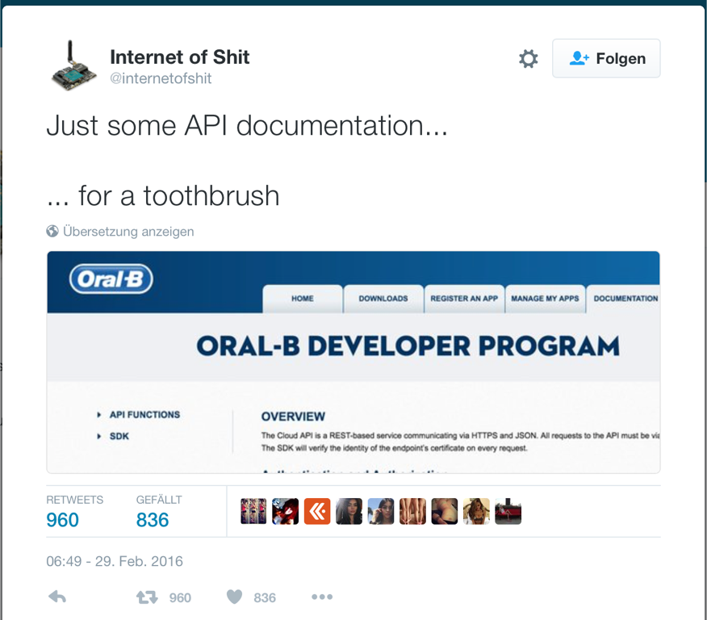
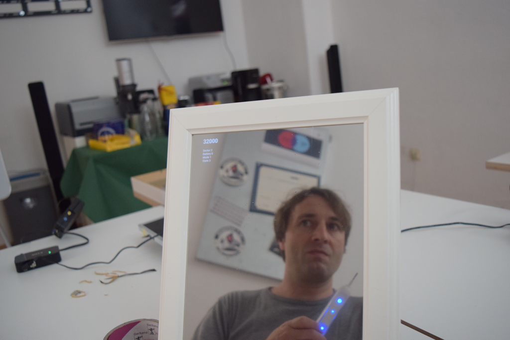
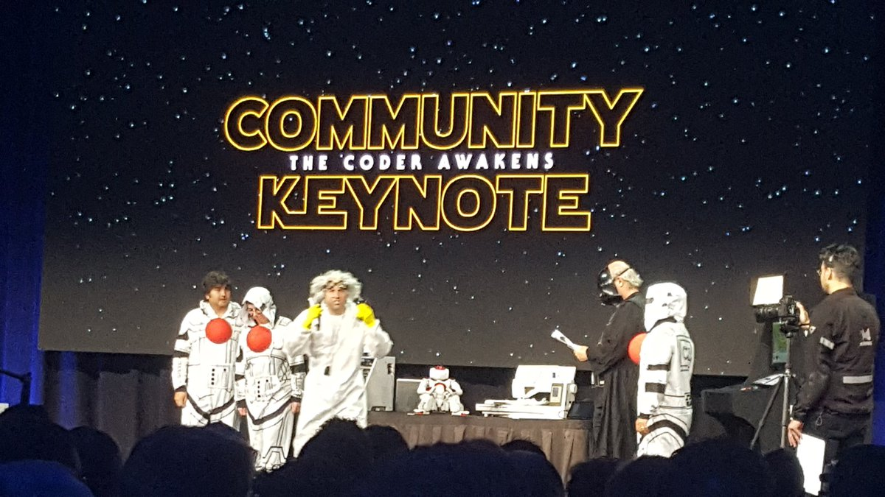

# DukeBrush

This demo project shows how you can use native libraries in a DukeScript application for Android.
The native API we're using is the [Oral B API](https://developer.oralb.com/). It allows
you to connect via Bluetooth LE to a toothbrush and to receive updates about brushing time, pressure
and the sector you're supposed to brush.

### Why?

I first discovered this API in my Twitter timeline. There's a twitter account that I follow
named @InternetOfShit. It is a reliable and steady source of fun. When I first 
read that there's an API for my personal cloud connected toothbrush, I was delighted.

Initially
 I only had some innocent fun chatting withsome of my friends at Oracle about
 the dangers of mixing up "Oral B"- and "Oracle"-cloud. 

But what kind of developer would be able to resist the temptations of a hackable
 device luring in the bathroom cabinet for long? Just imagine the possibilities! 

I could 
create a toothrush activated smart mirror that reacts on toothbrush status to motivate users 
to brush their teeth (this project here). 

Or - if that sounds too conservative - I could make James Gosling, the father of Java, 
 pretend it is a lightsaber in front of thousands of developers
 at the worlds biggest Java conference - in full Darth Vader cosplay.

## Prerequisites

Hardware Requirements: Android Phone with active [debug mode]() and Oral B Toothbrush with Bluetooth support.

Software Requirements: JDK 1.8, Maven, Android SDK, NetBeans 8.1 with DukeScript Plugin

You should also have at least once created a DukeScript project for Android. 
Otherwise the Android SDK will not be found by Maven during the build process.

To build this project you need to create an Oral B developer account and
register your own app to get an app id and a key. These steps are described in detail in the [documentation](https://developer.oralb.com/documentation).

Now clone this project and open file dukebrush/client-android/src/main/AndroidManifest.xml.
You can now replace ${oralb.appid} and ${oralb.appkey} with the data you received:

        <meta-data android:name="com.obt.sdk.ApplicationId" android:value="${oralb.appid}"/> 
        <meta-data android:name="com.obt.sdk.ApplicationKey" android:value="${oralb.appkey}"/>

Next you need to download and unpack your SDK and install the API to cour local Maven Repository:

    mvn install:install-file -Dfile=obt-sdk-production-release-1.0.1.aar  
              -DgroupId=com.obt
              -DartifactId=sdk 
              -Dversion=1.0.1 
              -Dpackaging=aar

Now you should be able to build the project and run it on your Android phone. To do so
open the project in NetBeans, right-click it and choose "custom"->"Run in Android".
When it's running, start brushing your teeth. 

## How to get it to work with DukeScript

DukeScript applications are based on Maven, while the Oral B Docs want you to use
 Gradle. But it wasn't too hard to fix that.

The main steps are getting the dependencies right. If you have a look at the 
pom of our project, you'll see a couple of changes to a standard DukeScript Android app.
First there's a dependency on the Oral B API:

    <dependency>
        <groupId>com.obt</groupId>
        <artifactId>sdk</artifactId>
        <version>1.0.1</version>
        <type>aar</type>
    </dependency>

Side note: If you're opening the project in an IDE, it will display a lot of errors, because the IDE doesn't
understand "aar" Archives. To prevent this, unpack the aar using a zip utility. There's a
file called classes.jar in it. Install this to your local repo: 

    mvn install:install-file -Dfile=classes.jar  
              -DgroupId=com.obt
              -DartifactId=sdk 
              -Dversion=1.0.1 
              -Dpackaging=jar

After that you can switch the dependency from "aar" to "jar" while coding. Just 
make sure to switch back to "aar" when you build the project.
 
In the AndroidManifest.xml I needed to override some version requirements from the Oral B 
API which are in conflict with DukeScript:

    <?xml version="1.0" encoding="utf-8"?>
    <manifest xmlns:android="http://schemas.android.com/apk/res/android"
              xmlns:tools="http://schemas.android.com/tools"
              package="com.dukescript.dukebrush"
              android:versionCode="1"
              android:versionName="1.0-SNAPSHOT" >
    
        <uses-sdk
            android:minSdkVersion="8"
            android:targetSdkVersion="16" 
            tools:overrideLibrary="com.oralb.sdk"/>  

We also need to register an Activity from Oral B that is sometimes displayed:

    <?xml version="1.0" encoding="utf-8"?>
    <manifest xmlns:android="http://schemas.android.com/apk/res/android"
              xmlns:tools="http://schemas.android.com/tools"
              package="com.dukescript.dukebrush"
              android:versionCode="1"
              android:versionName="1.0-SNAPSHOT" >
    
        <uses-sdk
            android:minSdkVersion="8"
            android:targetSdkVersion="16" 
            tools:overrideLibrary="com.oralb.sdk"/>  

And we needed to give our app some additional permissions for connecting to the toothbrush:

    <uses-permission android:name="android.permission.INTERNET" />
    <uses-permission android:name="android.permission.BLUETOOTH"/>
    <uses-permission android:name="android.permission.BLUETOOTH_ADMIN"/>
    <uses-permission android:name="android.permission.ACCESS_NETWORK_STATE"/>

DukeScript applications usually launch a default Activity. But since we need to access
native code and the Oral B API requires us to pass in an Activity, we also need to create 
one:

    <activity android:name="com.dukescript.dukebrush.AndroidMain"
              android:configChanges="orientation|screenSize">
        <intent-filter>
            <action android:name="android.intent.action.MAIN" />
            <category android:name="android.intent.category.LAUNCHER" />
        </intent-filter>
    </activity>

Later we pass control back to the default Activity which is registered like this:

    <activity android:name="com.dukescript.presenters.Android" 
              android:configChanges="orientation|screenSize">
        <intent-filter>
            <action android:name="android.intent.action.MAIN" />
            <category android:name="android.intent.category.LAUNCHER" />
        </intent-filter>
    </activity>
    …
    <meta-data android:name="loadPage" 
    android:value="file:///android_asset/pages/index.html" />
    <meta-data android:name="loadClass" 
    android:value="com.dukescript.dukebrush.AndroidMain" />
    <meta-data android:name="invoke" android:value="main" />

In the Java code this is how we pass the control back:

    public class AndroidMain extends Activity {
        @Override
        protected void onCreate(Bundle savedInstanceState) {
            super.onCreate(savedInstanceState);
            doStuffWithToothBrush();
            try {
                // delegate to default activity
                startActivity(new Intent(getApplicationContext(), 
                                      Class.forName("com.dukescript.presenters.Android")));
            } catch (ClassNotFoundException ex) {
                throw new IllegalStateException(ex);
            }
            finish();
        }
    
        public static void main(String... args) throws Exception {
            DataModel.onPageLoad();
        }

That's basically what we needed to do in order to set up the project and get DukeScript
to work with native libraries. The rest of the code is pretty straightforward normal use of
the Oral B APIs as described in their documentation.

This is how you authorize your use of the API:

    public void doStuffWithToothBrush() {
        try {
            OBTSDK.initialize(this);
        } catch (PackageManager.NameNotFoundException e) {
            e.printStackTrace();
        }
        OBTSDK.authorizeSdk(new OBTSdkAuthorizationListener() {
            @Override
            public void onSdkAuthorizationSuccess() {
                System.out.println("####################OBTSDK autorized");
                OBTSDK.setOBTBrushListener(someOBTBrushListener);
                OBTSDK.startScanning();
            }
    
            @Override
            public void onSdkAuthorizationFailed(int i) {
                System.out.println("####################onSdkAuthorizationFailed");
            }
        });
    }

And inside the listener you can manipulate DukeScript ViewModels to update the view.

